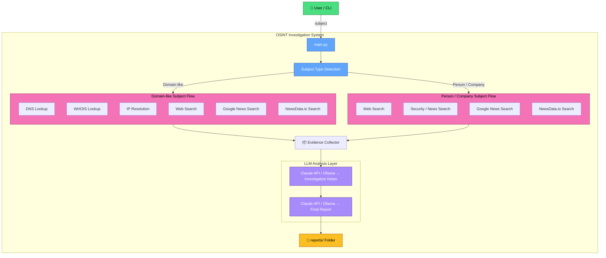

# Architecture Document - Fireblocks Investigation Agent

## 1. Overview

Fireblocks Investigation Agent is a local 
proof-of-concept AI investigation agent powered by the Claude API.

The goal of the system is to investigate a given subject, such as a person, company, domain, or other entity, and generate a structured investigation report. The agent autonomously collects available evidence from external tools, sends the collected evidence to an LLM for analysis, and produces a final Markdown report.

The project is intentionally lightweight and designed to be completed and reviewed as a small POC. It runs locally from the command line and does not require a database, web server, or complex infrastructure.

Example usage:

```powershell
python main.py --subject example.com
```
## 2. Current System Design
### 2.1 High-Level Architecture

The current system is built from four main components:

1. Command-line interface
2. Investigation tool layer
3. LLM reasoning layer
4. Report generation layer

#### The Flow
* The user provides a subject to investigate. 
* The agent decides which tools to run based on the subject format. 
* The collected evidence is sent to the selected LLM for investigation reasoning, 
* Then the LLM generates a final structured report.

### 2.2 System Flow Diagram




## 3. Component Description
### 3.1 main.py

```main.py``` is the main entry point of the application.

#### Responsibilities:

* Parse command-line arguments. 
* Accept the investigation subject. 
* Start the investigation process. 
* Call the tool layer. 
* Send collected evidence to the LLM. 
* Generate the final report. 
* Save the report locally.

The application accepts a subject using the ```--subject``` argument.

#### Examples:
```
python main.py --subject example.com 
```
For names or companies with spaces, the agent also supports:
```
python main.py --subject "Elon Musk"
```
or, if configured with nargs="+":
```
python main.py --subject Elon Musk
```

### 3.2 tools.py

```tools.py``` contains the data collection tools used by the agent.

#### Current tools include:

* DNS lookup 
* IP resolution 
* WHOIS lookup 
* Brave Search 
* Google news search
* Newsdata.io search

The tool layer returns structured dictionaries. 

These dictionaries are later passed to the LLM as collected evidence.

For **domain-like** subjects, the agent runs:

* DNS lookup 
* IP lookup 
* WHOIS lookup
* Web search 
* Security-related web search
* Google news search
* Newsdata.io search

For **person or company** subjects, the agent runs:

* General web search
* Security, fraud, scam, or breach-related web search

If a tool fails or an API key is missing, 
the tool returns a structured error or skipped result instead of crashing the entire agent.

### 3.3 prompts.py

```prompts.py``` contains the LLM instructions.

It includes:

* A system prompt defining the LLM as an autonomous investigation agent.
* A final report prompt that defines the required report structure.

The prompt instructs the model to:

* Avoid inventing facts.
* Use only provided evidence.
* Separate facts from assumptions.
* Identify risk signals.
* Identify missing context.
* Generate a clean structured report. 

### 3.4 LLM Layer

The LLM layer is responsible for reasoning and synthesis.

The project is designed around the Claude API as required in the assignment.

Claude receives the subject and the evidence collected by the tool layer, then generates investigation notes and a final report.

The current implementation may also include a local fallback provider using Ollama for development and testing when Claude API credits are unavailable. 

This fallback does not replace the intended Claude architecture; it only helps local development.

The LLM is used in two stages:

* Evidence analysis
* Final report generation

### 3.5 Reports

The ```reports/``` directory stores generated Markdown reports.

Each report is saved with a safe filename based on the model used, subject and a UTC timestamp.

Example:
```
reports/claude_example_com_20260505_113000.md
```

## 4. Agent Implementation

The agent uses a simple autonomous investigation loop.

The current loop is intentionally small:

* Receive subject.
* Detect whether the subject looks like a domain.
* Run relevant tools.
* Collect tool results as evidence.
* Ask the LLM to analyze the evidence.
* Ask the LLM to generate a final structured report.
* Save the report.

Although the loop is not a full recursive planner, it demonstrates the main requirement of an investigation agent: 

The system gathers information,  reasons over it, and produces a structured final report without the user manually writing the report.

Start
 -> 
Receive subject
 ->
Classify subject type
->
Run relevant tools
->
Collect evidence
->
Analyze evidence with LLM
->
Generate report with LLM
->
Save report
->
End

## 5. Final Report Structure

The final output is a Markdown report.

The report includes:

* Subject
* Executive summary
* Key findings
* Evidence collected
* Risk assessment
* Indicators / technical details
* Gaps and limitations
* Recommended next steps
* Final verdict

Example report sections:

```
# Investigation Report

## Subject

## Executive Summary

## Key Findings

## Evidence Collected

## Risk Assessment

## Indicators / Technical Details

## Gaps and Limitations

## Recommended Next Steps

## Final Verdict
```

The final verdict is one of:

* Clean
* Suspicious
* Malicious
* Inconclusive

## 6. Testing Strategy

Testing should cover both the tool layer and the agent flow.

Recommended tests:

* DNS lookup for a valid domain.
* WHOIS lookup for a valid domain.
* Tool behavior when a domain does not resolve.
* Behavior when BRAVE_API_KEY is missing.
* Behavior when ANTHROPIC_API_KEY is missing.
* Report file creation.
* Subject parsing with spaces.
* Mocked LLM response handling.
* Full end-to-end test with a known domain.

Example test cases:

* `python main.py --subject example.com`
* `python main.py --subject Fireblocks`
* `python main.py --subject Elon Musk`


## 7. Future Development and Vision

The future version of the system can evolve into a more complete investigation platform.

### 7.1 Dynamic Agent Planning

The current tool execution flow is mostly fixed. 

A future version should allow Claude to decide which tool to call next based on the current evidence.

Future loop:

Claude reviews evidence
->
Claude selects next tool
->
Tool executes
->
Result is returned to Claude
->
Claude decides whether more investigation is needed
->
Final report is generated

This would make the agent more autonomous and closer to a real investigation workflow.

### 7.2 Additional Tools

Future tools could include:

* GDELT news search (current 429 Too Many Request Issue)
* VirusTotal
* URLScan.io
* Shodan
* Censys
* Certificate transparency logs
* Passive DNS
* IP reputation services
* Hash investigation.
* Blockchain wallet intelligence
* GitHub search
* Social media or public profile search
* Internal SIEM or case-management data


### 7.3 Better Report Formats

Future report outputs should include a selection option between:

* Markdown
* JSON
* PDF
* HTML

JSON would be useful for automation and integrations.

PDF or HTML would be useful for human-readable reporting and sharing.

### 7.4 Persistent Memory

A future version could use SQLite or another lightweight database to store:

* Previous investigations
* Subjects 
* Evidence
* Reports
* Risk classifications
* Analyst feedback

This would allow the agent to compare new investigations against previous cases and improve consistency.

### 7.5 Security Considerations

The system handles API keys and external content, so security controls are important.

Recommended controls:

* Validate user input.
* Clearly mark untrusted external data.
* Avoid executing data returned from external sources.
* Keep generated reports separate from source code.
* Avoid public data scans.
* Better API and secrets management.
* User & Network Access controls.

## 8. Repository and Pull Request Workflow
The repository uses two branches:

- `master` - default branch
- `main` - development branch

The `master` branch is configured as the default branch and represents the stable version of the project. Development work is performed on `main`, and changes should be merged into `master` using pull requests.

This workflow allows code changes, documentation updates, and future features to be reviewed before being added to the default branch.

### Pull Request Flow

```text
Developer
   |
   v
main branch
   |
   v
Pull Request
   |
   v
Review / Validation
   |
   v
master branch
```